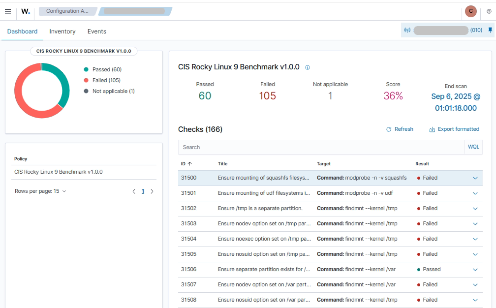

# ⚙️ Configuración de Baseline de Agentes
**Periodo:** 05–10 septiembre 2025  
**Autor:** Jorge Bonete Palomeque  

---

## ✅ Paso 1 – Verificación de grupos de agentes

**🎯 Objetivo:**  
Comprobar que los agentes estén asignados correctamente a los grupos lógicos del SIEM creados.

**📌 Grupos creados:**
- 🖥️ `siem_core` → Infraestructura de núcleo  
- 💾 `siem_bbdd` → Bases de datos críticas  
- 🌐 `siem_apps` → Servidores de aplicaciones (WildFly, Tomcat, etc.)  
- 💻 `siem_endpoints` → Estaciones de trabajo / terminales  
- 🛡️ `siem_ad_dc` → Controladores de dominio Active Directory  
- 📂 `default` → Grupo temporal/baseline

---

**💻 Comando ejecutado:** (También se puede ver graficamente en el Dashboard)
# bash
    sudo /var/ossec/bin/agent_groups -l

## 📌 Resultado
        Groups (6):
        default (2)
        siem_ad_dc (2)
        siem_apps (4)
        siem_bbdd (5)
        siem_core (8)
        siem_endpoints (20)
        Unassigned agents: 0

## ✅ Paso 2 – Listado y estado de agentes

**🎯 Objetivo:**
Validar que los agentes conectados estén en estado Active, y detectar cuáles permanecen en Disconnected para hacer seguimiento o eliminarlos.

**💻 Comando ejecutado:** (También se puede ver graficamente en el Dashboard)
# bash
    sudo /var/ossec/bin/agent_control -l

## 📌 Resultado
        Wazuh agent_control. List of available agents:
        ID: 000, Name: name_server_00, IP: 192.168.1.1, Active/Local
        ID: 009, Name: name_server_09, IP: 192.168.1.9, Disconnected
        ID: 010, Name: name_server_10, IP: 192.168.1.10, Active
        ID: 011, Name: name_server_11, IP: 192.168.1.11, Active
        ID: 012, Name: name_server_12, IP: 192.168.1.12, Active
        ID: 013, Name: name_server_13, IP: 192.168.1.13, Active
        ID: 014, Name: name_server_14, IP: 192.168.1.14, Active
        ID: 015, Name: name_server_15, IP: 192.168.1.15, Active
        ID: 016, Name: name_server_16, IP: 192.168.1.16, Active
        ID: 017, Name: name_server_17, IP: 192.168.1.17, Active
        ID: 018, Name: name_server_18, IP: 192.168.1.18, Active
        ID: 019, Name: name_server_19, IP: 192.168.1.19, Active
        ID: 020, Name: name_server_20, IP: 192.168.1.20, Active
        ID: 021, Name: name_server_21, IP: 192.168.1.21, Active
        ID: 022, Name: name_server_22, IP: 192.168.1.22, Active
        ID: 023, Name: name_server_23, IP: 192.168.1.23, Active
        ID: 024, Name: name_server_24, IP: 192.168.1.24, Active
        ID: 025, Name: name_server_25, IP: 192.168.1.25, Active
        ID: 026, Name: name_server_26, IP: 192.168.1.26, Disconnected
        ID: 027, Name: name_server_27, IP: 192.168.1.27, Active

List of agentless devices: (vacío)

## ✅ Paso 3 – Verificación del baseline en `default/agent.conf`

**🎯 Objetivo:**  
Verificar si el grupo `default` ya tiene definido un baseline con 
    **SCA (Security Configuration Assessment)**
    **FIM (File Integrity Monitoring)**
    **Syscollector**.  

**💻 Comando ejecutado:**  
# bash  

    vim /var/ossec/etc/shared/default/agent.conf

## 📌 Resultado  
    ✔ Hace un chequeo de seguridad (SCA) cada 12h.
    ✔ Vigila archivos y registro críticos en tiempo real + revisiones cada 12h (FIM).
    ✔ Recolecta inventario completo de hardware/software/red cada 24h (Syscollector).
    ✔ Incluye configuraciones diferenciadas para Linux y Windows.
    ✔ Reduce ruido al ignorar logs y caches.

    ⚙️📄-------------------------------------------------------------------------------⚙️📄
            <agent_config>
            <!-- SCA: Security Configuration Assessment -->
            <sca>
                <enabled>yes</enabled>
                <scan_on_start>yes</scan_on_start>
                <interval>12h</interval>
            </sca>

            <!-- FIM (Linux): File Integrity Monitoring -->
            <syscheck>
                <enabled>yes</enabled>
                <!-- Revisión completa cada 12h; tiempo real para rutas críticas -->
                <frequency>43200</frequency>
                <directories check_all="yes" realtime="yes">/etc</directories>
                <directories check_all="yes" realtime="yes">/usr/bin</directories>
                <directories check_all="yes" realtime="yes">/usr/sbin</directories>
                <directories check_all="yes" realtime="yes">/var/www</directories>
                <!-- Exclusiones de ruido -->
                <ignore>/etc/mtab</ignore>
                <ignore>/var/log</ignore>
                <ignore>/var/cache</ignore>
                <ignore type="sregex">.*\.log$</ignore>
            </syscheck>

            <!-- Syscollector (inventario Linux) -->
            <syscollector>
                <enabled>yes</enabled>
                <interval>24h</interval>
                <os>yes</os>
                <hardware>yes</hardware>
                <netaddr>yes</netaddr>
                <netproto>no</netproto>
                <netiface>yes</netiface>
                <packages>yes</packages>
                <ports all="no">yes</ports>
                <processes>no</processes>
            </syscollector>
            </agent_config>

            <!-- Baseline específico para Windows -->
            <agent_config os="windows">
            <!-- FIM Windows (archivos y registro) -->
            <syscheck>
                <enabled>yes</enabled>
                <frequency>43200</frequency>
                <directories check_all="yes" realtime="yes">C:\Windows\System32</directories>
                <directories check_all="yes" realtime="yes">C:\Program Files</directories>
                <directories check_all="yes" realtime="yes">C:\Program Files (x86)</directories>
                <!-- Registro crítico de inicio y políticas -->
                <registry>HKEY_LOCAL_MACHINE\Software\Microsoft\Windows\CurrentVersion\Run</registry>
                <registry>HKEY_LOCAL_MACHINE\Software\Policies</registry>
                <!-- Exclusiones de ruido comunes -->
                <ignore type="sregex">.*\.log$</ignore>
                <ignore type="sregex">.*Temp.*</ignore>
            </syscheck>

            <!-- SCA Windows -->
            <sca>
                <enabled>yes</enabled>
                <scan_on_start>yes</scan_on_start>
                <interval>12h</interval>
            </sca>

            <!-- Syscollector Windows -->
            <syscollector>
                <enabled>yes</enabled>
                <interval>24h</interval>
                <os>yes</os>
                <hardware>yes</hardware>
                <netaddr>yes</netaddr>
                <netproto>no</netproto>
                <netiface>yes</netiface>
                <packages>yes</packages>
                <ports all="no">yes</ports>
                <processes>no</processes>
            </syscollector>
            </agent_config>
    ⚙️📄-------------------------------------------------------------------------------⚙️📄

## ✅ Paso 4 – Validación de baseline en un agente

**🎯 Objetivo:**  
Comprobar la configuración distribuida desde `default/agent.conf`.

**💻 Comando ejecutado:**  
# bash  
    sudo /var/ossec/bin/agent_control -i 010

## 📌 Resultado  
        Wazuh agent_control. Agent information:
           Agent ID:   010
           Agent Name: name_server_10
           IP address: 192.168.1.10
           Status:     Active

           Operating system:    Linux | name_server_10 | 5.14.0-570.32.1.el9_6.x86_64
           #1 SMP PREEMPT_DYNAMIC Fri Aug 8 18:29:23 UTC 2025 | x86_64
           Client version:      Wazuh v4.12.0
           Configuration hash:  1b163817bc26e40a6806f460c0cdf7d8
           Shared file hash:    24914d97d88d4127d62796e3d9272bbf
           Last keep alive:     Fri Sep 05 13:03:09 2025

           Syscheck last started at:  Fri Sep  5 13:02:12 2025
           Syscheck last ended at:    Fri Sep  5 13:02:18 2025

➡️ **📝 Explicación:**
    - El agente `010` está en estado **Active** y reporta normalmente.  
    - Los hashes de configuración (`Configuration hash` y `Shared file hash`) confirman que recibió el baseline del Manager que vimos anteriormente.  
    - El módulo **Syscheck (FIM)** corrió exitosamente tras el ultimo reinicio del Manager.  
    - Esto asegura que el **baseline (SCA, FIM y Syscollector)** está activo.  

<figure>
  
  <figcaption><b>Figura 1.</b> Evidencia del módulo <b>SCA</b> ejecutando el benchmark <i>CIS Rocky Linux 9 v1.0.0</i> en el agente 010.</figcaption>
</figure>