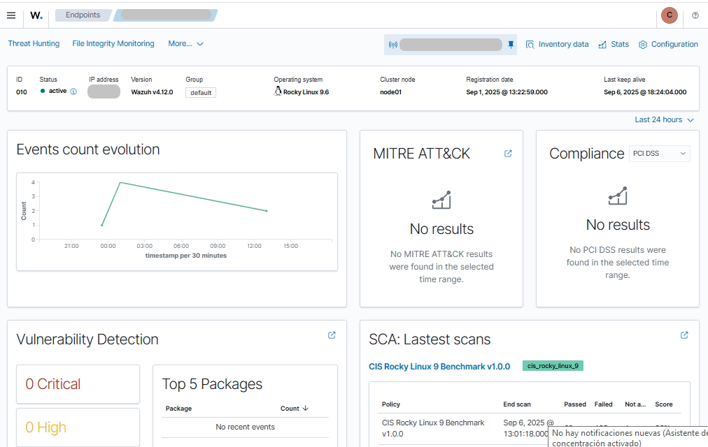

# ⚙️ Configuración de ISM, Snapshots y Monitores
**Periodo:** 06 septiembre 2025  
**Autor:** Jorge Bonete Palomeque  

---

## ✅ Paso 1 – Índices diarios y plantilla (shards/réplicas)

**🎯 Objetivo:**  
Verificar el patrón de índices `wazuh-alerts-*` y documentar la configuración de shards/réplicas.

**💻 Comando ejecutado:**
```bash
curl -sS --cert /etc/wazuh-indexer/certs/admin.pem \
     --key  /etc/wazuh-indexer/certs/admin-key.pem \
     --cacert /etc/wazuh-indexer/certs/root-ca.pem \
     --resolve nodo-datos.dominio.com.ec:9200:192.168.1.20 \
     "https://nodo-datos.dominio.com.ec:9200/_cat/indices/wazuh-alerts-*?s=index&v"
```

**📌 Resultado (extracto):**
```
health status index                       pri rep docs.count store.size
green  open   wazuh-alerts-4.x-2025.09.06 1   0       37495     39.9mb
green  open   wazuh-alerts-4.x-2025.09.07 1   0        1628      2.9mb
...
```

**📝 Explicación:**  
- Wazuh crea **un índice por día** (`wazuh-alerts-4.x-YYYY.MM.DD`).  
- En el entorno actual (1 nodo de datos) la plantilla de índices fija:  
  - `number_of_shards = 1` (1 shard primario por índice).  
  - `number_of_replicas = 0` (sin réplicas para evitar shards inasignados, con un solo nodo de datos).  
- Esta configuración es óptima para 1 nodo. Al agregar un segundo nodo, se puede elevar a `number_of_replicas = 1` (en caliente y en el template).

**💻 Comando ejecutado — Ver plantilla efectiva:**
```bash
curl -sS --cert /etc/wazuh-indexer/certs/admin.pem \
     --key  /etc/wazuh-indexer/certs/admin-key.pem \
     --cacert /etc/wazuh-indexer/certs/root-ca.pem \
     --resolve nodo-datos.dominio.com.ec:9200:192.168.1.20 \
     "https://nodo-datos.dominio.com.ec:9200/_index_template?name=wazuh-alerts*"
```

**📌 Resultado (extracto relevante):**
```json
{
  "index_templates": [{
    "name": "wazuh-alerts-4x-tuning",
    "index_template": {
      "index_patterns": ["wazuh-alerts-4.x-*"],
      "template": {
        "settings": {
          "index": {
            "number_of_shards": "1",
            "number_of_replicas": "0",
            "refresh_interval": "5s"
          }
        }
      }
    }
  }]
}
```

**📷 Evidencia:**  
Captura del listado de índices diarios en Dashboard/Index Management.
<figure>
  
  <figcaption><b>Figura 1.</b> Evidencia de listado de indices diarios <b>Syscollector</b> Indices 
  recolectados hasta el momento.</figcaption>
</figure>
---

## ✅ Paso 2 – Política ISM de retención (Hot → Warm → Delete)

**🎯 Objetivo:**  
Confirmar que `wazuh-alerts-*` está gestionado por la política `wazuh-retention-90d` con transición automática por edad.

**💻 Comando ejecutado — Explain:**  
```bash
curl -sS --cert /etc/wazuh-indexer/certs/admin.pem \
     --key  /etc/wazuh-indexer/certs/admin-key.pem \
     --cacert /etc/wazuh-indexer/certs/root-ca.pem \
     --resolve srvwazuh.coopsi.fin.ec:9200:10.10.7.6 \
     -XGET "https://srvwazuh.coopsi.fin.ec:9200/_plugins/_ism/explain/wazuh-alerts-*?pretty" | jq
```

**📌 Resultado (extracto):**
```json
{
  "wazuh-alerts-4.x-2025.09.06": {
    "policy_id": "wazuh-retention-90d",
    "state": { "name": "hot" },
    "step": { "name": "attempt_transition_step", "step_status": "condition_not_met" },
    "enabled": true
  },
  "total_managed_indices": 27
}
```

**📝 Explicación:**  
- **ISM (Index State Management)** es el “mayordomo” que automatiza el ciclo de vida de índices.  
- Política actual **`wazuh-retention-90d`**:  
  - **Hot (0–30d):** datos recientes.  
  - **Warm (30–90d):** se fija **read_only** y **force_merge (1 segmento)** para optimizar.  
  - **Delete (>90d):** eliminación automática.  
- Los índices nuevos heredan la policy **automáticamente** gracias a `ism_template`.

**💻 Comando ejecutado — Ver política (actualizada y válida):**
```bash
curl -sS --cert /etc/wazuh-indexer/certs/admin.pem \
     --key  /etc/wazuh-indexer/certs/admin-key.pem \
     --cacert /etc/wazuh-indexer/certs/root-ca.pem \
     --resolve srvwazuh.coopsi.fin.ec:9200:10.10.7.6 \
     -XGET "https://srvwazuh.coopsi.fin.ec:9200/_plugins/_ism/policies/wazuh-retention-90d" | jq
```

**📌 Resultado (extracto relevante):**
```json
{
  "policy": {
    "policy_id": "wazuh-retention-90d",
    "default_state": "hot",
    "states": [
      { "name": "hot", "actions": [],
        "transitions": [ { "state_name": "warm", "conditions": { "min_index_age": "30d" } } ]
      },
      { "name": "warm",
        "actions": [
          { "read_only": {}, "retry": { "count": 3, "backoff": "exponential", "delay": "1m" } },
          { "force_merge": { "max_num_segments": 1 }, "retry": { "count": 3, "backoff": "exponential", "delay": "1m" } }
        ],
        "transitions": [ { "state_name": "delete", "conditions": { "min_index_age": "90d" } } ]
      },
      { "name": "delete",
        "actions": [ { "delete": {}, "retry": { "count": 3, "backoff": "exponential", "delay": "1m" } } ],
        "transitions": []
      }
    ],
    "ism_template": [ { "index_patterns": ["wazuh-alerts-*"], "priority": 100 } ]
  }
}
```

**📷 Evidencia:**  
Explain del índice diario mostrando `policy_id` y `state: hot` (con transición pendiente por edad).

---

## ✅ Paso 3 – Snapshots: repositorio y snapshot de prueba

**🎯 Objetivo:**  
Configurar `path.repo`, registrar un repositorio de snapshots y ejecutar un snapshot de prueba para `wazuh-alerts-*`.

### 3.1 Verificar `path.repo`
**💻 Comando ejecutado:**
```bash
grep -n "^path.repo" /etc/wazuh-indexer/opensearch.yml || grep -n "^path.repo" /etc/opensearch/opensearch.yml
```

**📌 Resultado esperado:**  
```
path.repo: ["/mnt/data/opensearch-snapshots"]
```

### 3.2 Registrar repositorio `wz_snap`
**💻 Comando ejecutado:**
```bash
curl -sS --cert /etc/wazuh-indexer/certs/admin.pem \
     --key  /etc/wazuh-indexer/certs/admin-key.pem \
     --cacert /etc/wazuh-indexer/certs/root-ca.pem \
     --resolve srvwazuh.coopsi.fin.ec:9200:10.10.7.6 \
     -XPUT "https://srvwazuh.coopsi.fin.ec:9200/_snapshot/wz_snap" \
     -H 'Content-Type: application/json' \
     -d '{ "type": "fs", "settings": { "location": "/mnt/data/opensearch-snapshots", "compress": true } }'
```

**📌 Resultado esperado:**  
`{ "acknowledged": true }`

### 3.3 Snapshot de prueba (sin global state)
**💻 Comando ejecutado:**
```bash
SNAP_ID="snap_test_2025-09-06"
curl -sS --cert /etc/wazuh-indexer/certs/admin.pem \
     --key  /etc/wazuh-indexer/certs/admin-key.pem \
     --cacert /etc/wazuh-indexer/certs/root-ca.pem \
     --resolve srvwazuh.coopsi.fin.ec:9200:10.10.7.6 \
     -XPUT "https://srvwazuh.coopsi.fin.ec:9200/_snapshot/wz_snap/$SNAP_ID?wait_for_completion=true" \
     -H 'Content-Type: application/json' \
     -d '{ "indices": "wazuh-alerts-*", "ignore_unavailable": true, "include_global_state": false }'
```

**📌 Resultado esperado:**  
`"state": "SUCCESS"` y detalle de shards copiados.

### 3.4 Verificar snapshot
**💻 Comandos ejecutados:**
```bash
curl -sS --cert /etc/wazuh-indexer/certs/admin.pem \
     --key  /etc/wazuh-indexer/certs/admin-key.pem \
     --cacert /etc/wazuh-indexer/certs/root-ca.pem \
     --resolve srvwazuh.coopsi.fin.ec:9200:10.10.7.6 \
     -XGET "https://srvwazuh.coopsi.fin.ec:9200/_snapshot/wz_snap/_all?pretty" | jq

curl -sS --cert /etc/wazuh-indexer/certs/admin.pem \
     --key  /etc/wazuh-indexer/certs/admin-key.pem \
     --cacert /etc/wazuh-indexer/certs/root-ca.pem \
     --resolve srvwazuh.coopsi.fin.ec:9200:10.10.7.6 \
     -XGET "https://srvwazuh.coopsi.fin.ec:9200/_snapshot/wz_snap/$SNAP_ID?pretty" | jq
```

**📷 Evidencia:**  
Listado del repositorio `wz_snap` y detalle del `snap_test_2025-09-06` en estado **SUCCESS**.

---

## ✅ Paso 4 – Monitores por grupo (sev ≥ 7) — sin SMTP

**🎯 Objetivo:**  
Crear monitores de severidad **≥ 7** por grupo: `siem_core`, `siem_apps`, `siem_bbdd`, `siem_endpoints`, `siem_ad_dc`, `default`.

### 4.1 Detectar el campo de grupo
**💻 Comandos ejecutados:**
```bash
curl -sS --cert /etc/wazuh-indexer/certs/admin.pem \
     --key  /etc/wazuh-indexer/certs/admin-key.pem \
     --cacert /etc/wazuh-indexer/certs/root-ca.pem \
     --resolve srvwazuh.coopsi.fin.ec:9200:10.10.7.6 \
     -XGET "https://srvwazuh.coopsi.fin.ec:9200/wazuh-alerts-*/_mapping/field/agent.*?pretty" | jq
```
*(Luego se probó con agregaciones y se confirmó usar `agent.group.keyword` o `agent.groups.keyword` según mapping).*

### 4.2 Plantilla de monitor (por grupo)
**💻 Cuerpo JSON (plantilla):**
```json
{
  "type": "monitor",
  "name": "ALERT: Wazuh sev>=7 (<GROUP>)",
  "monitor_type": "query_level_monitor",
  "enabled": true,
  "schedule": { "period": { "interval": 5, "unit": "MINUTES" } },
  "inputs": [{
    "search": {
      "indices": ["wazuh-alerts-*"],
      "query": {
        "size": 0,
        "query": {
          "bool": {
            "filter": [
              { "range": { "rule.level": { "gte": 7 } } },
              { "term": { "<FIELD>": "<GROUP>" } }
            ]
          }
        }
      }
    }
  }],
  "triggers": [{
    "name": "sev>=7 events present",
    "severity": "1",
    "condition": { "script": { "source": "return ctx.results[0].hits.total.value > 0" } },
    "actions": []
  }]
}
```

**💻 Comando de creación (ejemplo para un grupo):**
```bash
curl -sS --cert /etc/wazuh-indexer/certs/admin.pem \
     --key  /etc/wazuh-indexer/certs/admin-key.pem \
     --cacert /etc/wazuh-indexer/certs/root-ca.pem \
     --resolve srvwazuh.coopsi.fin.ec:9200:10.10.7.6 \
     -XPOST "https://srvwazuh.coopsi.fin.ec:9200/_plugins/_alerting/monitors" \
     -H 'Content-Type: application/json' \
     --data-binary @/tmp/monitor-siem_core.json
```

**📌 Resultado esperado:**  
`{"_id":"<MONITOR_ID>", "monitor": {...}}`

### 4.3 Validación
**💻 Comandos ejecutados:**
```bash
curl -sS --cert /etc/wazuh-indexer/certs/admin.pem \
     --key  /etc/wazuh-indexer/certs/admin-key.pem \
     --cacert /etc/wazuh-indexer/certs/root-ca.pem \
     --resolve srvwazuh.coopsi.fin.ec:9200:10.10.7.6 \
     -XGET "https://srvwazuh.coopsi.fin.ec:9200/_plugins/_alerting/monitors?search=sev%3E%3D7"

curl -sS --cert /etc/wazuh-indexer/certs/admin.pem \
     --key  /etc/wazuh-indexer/certs/admin-key.pem \
     --cacert /etc/wazuh-indexer/certs/root-ca.pem \
     --resolve srvwazuh.coopsi.fin.ec:9200:10.10.7.6 \
     -XPOST "https://srvwazuh.coopsi.fin.ec:9200/_plugins/_alerting/monitors/<MONITOR_ID>/_execute"
```

**📷 Evidencia:**  
Listado de monitores creados y ejecución manual con `ctx.results[0].hits.total.value` > 0 cuando hay eventos sev≥7.

---

## ✅ Checklist de Cierre — Día 2 (06-sep-2025)

- ISM aplicado y confirmado con `explain` ✅  
- Política `wazuh-retention-90d` con `ism_template` vigente ✅  
- Repositorio de snapshots (`wz_snap`) creado ✅  
- Snapshot de prueba ejecutado y verificado ✅  
- Monitores por grupo (sev ≥ 7) creados y validados (sin SMTP) ✅  

**Notas:**  
- Cuando se habilite SMTP, añadir `actions` a cada monitor (destinations + plantilla).  
- Con un segundo nodo de datos, subir `number_of_replicas` a `1` en el template y, si se desea, aplicar en caliente a índices abiertos.
